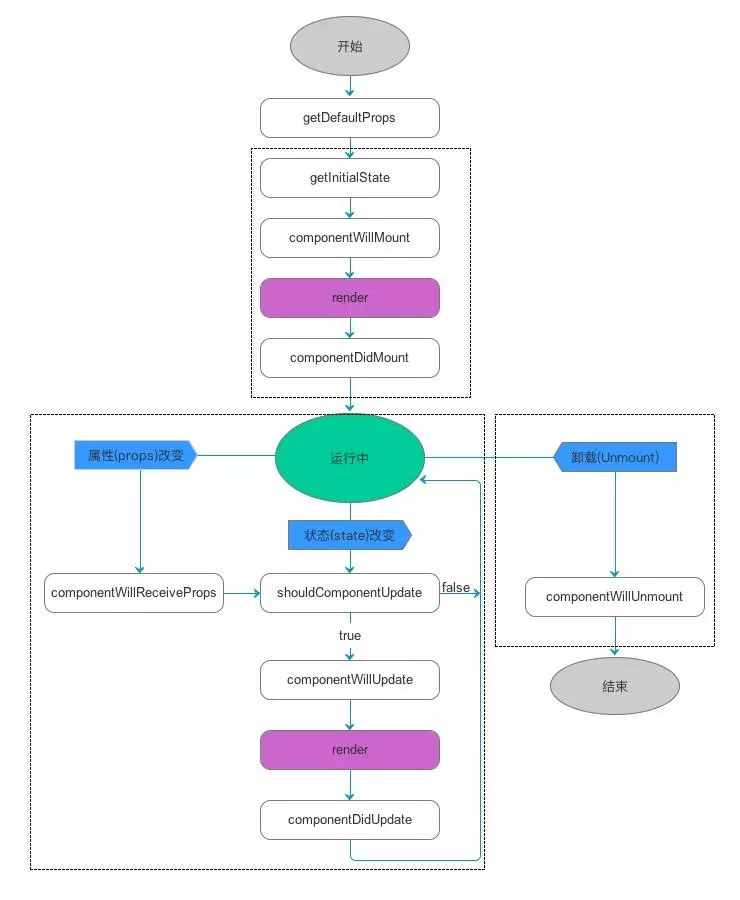

### React 生命周期

  React的生命周期可以分为三个阶段：挂载渲染、数据更新、卸载。
  React的生命周期图(react16.3之前)：

 <br />

#### 一：挂载渲染阶段：

  当组件在客户端被渲染的时候，第一次被创建时，在客户端以下方法依次被调用：

  1. getDefaultProps
  2. getInitalState
  3. componentWillMount
  4. render
  5. componentDidMount

  如果是在服务器端渲染的话，第一次被创建时，如下方法会被依次调用：

  1. getDefaultProps
  2. getInitalState
  3. componentWillMount
  4. render

#### 1.1 getDefaultProps

  对于React组件实列来说，该生命周期在整个过程中，只会在初始化被调用一次。其返回的对象用于设置默认的props的值。
  基本代码演示：
```
import React from 'react';
import ReactDOM from 'react-dom';

class App extends React.Component {
  /*
  // 如下是react中老版本的写法
  getDefaultProps: function() {
    return {
      name: 'kongzhi'
    }
  },
  */
  render() {
    return (
      <div>Hello, {this.props.name}</div>
    )
  }
}
// 如下是react新版本设置默认的props的写法
App.defaultProps = {
  name: 'kongzhi'
};
// 创建一个组件实列，将组件挂载到元素上
ReactDOM.render(<App />, document.getElementById('app'));
```
  我们也可以在挂载组件的时候设置props，如下代码：
```
import React from 'react';
import ReactDOM from 'react-dom';

class App extends React.Component {
  render() {
    console.log(this.props);
    return (
      <div>Hello, {this.props.data.name}</div>
    )
  }
}
var data = {
  name: 'kongzhi'
};
// 创建一个组件实列，将组件挂载到元素上
ReactDOM.render(<App data={data} />, document.getElementById('app'));
```
  React 也可以通过 propTypes 提供了一种验证props的方式，propTypes是一个配置对象，用于定于属性类型：
```
import React from 'react';
import ReactDOM from 'react-dom';
import PropTypes from 'prop-types';

class App extends React.Component {
  render() {
    console.log(this.props);
    return (
      <div>Hello, {this.props.data.name}</div>
    )
  }
}
var data = {
  name: 'kongzhi'
};
// 用于检查属性类型
App.propTypes = {
  data: PropTypes.object
}
// 创建一个组件实列，将组件挂载到元素上
ReactDOM.render(<App data={data} />, document.getElementById('app'));
```
  详情的请看官网 (https://react.docschina.org/docs/typechecking-with-proptypes.html)

#### 1.2 getInitalState/constructor

  对于React组件来说，该方法也只会被调用一次，用来初始化每个实例的state。在该方法里面，我们可以访问组件的props。每一个react组件都有自己的state，但是props和state的区别是：state只存在组件的内部，而props在所有实例中都是共享的。

  但是 React 在ES6的实现中去掉了 getInitalState 这个hook函数，规定state在constructor中实现，如下基本的代码：
```
class App extends React.Component {
  constructor(props) {
    super(props);
    this.state = {};
  }
}
```
  constructor()中完成了React数据的初始化，它接收2个参数: props, context. 当我们想在函数内部使用这两个参数的时候，我们需要使用 super() 传入这两个参数。
#### 注意：我们使用了constructor()的话，就必须要写 super(), 否则会导致 this 指向错误。

#### 1.3 componentWillMount

  组件在加载时调用，以后组件更新不调用，整个生命周期只调用一次，在该生命周期中我们可以修改state。该生命周期在服务器端渲染用的比较多。

#### 1.4 render

  在该生命周期中会创建一个虚拟的DOM，用来表示组件的输出。在每一次组件更新时候，在此声明周期，react会通过diff算法比较更新前后的新旧DOM树，然后获取之间的差异，然后会把差异的那部分渲染到DOM节点中。

#### 1.5 componentDidMount

  该方法不会在服务器端被渲染调用。该方法在客户端被调用时，已经渲染出真实的DOM，我们可以在该生命周期中对DOM节点进行操作。

  如上就是React在挂载阶段中 各个生命周期的含义及作用，我们下面可以使用Deom对各个生命周期分别打印出来看看效果：
```
import React from 'react';
import ReactDOM from 'react-dom';

class App extends React.Component {
  constructor(props, context) {
    console.log(props);
    console.log(context);
    super(props, context);
    console.log('第一步初始化');
    this.state = {
      name: 'kongzhi'
    }
  }
  // 组件将要被挂载时候触发的生命周期函数
  componentWillMount() {
    console.log('第二步组件将要挂载');
  }
  componentDidMount() {
    console.log('第四步可以获取到真实的DOM元素了');
  }
  render() {
    console.log('第三步数据被渲染');
    console.log(this.props);
    return (
      <div>Hello, {this.props.name}</div>
    )
  }
}
// 如下是react新版本设置默认的props的写法
App.defaultProps = {
  name: 'kongzhi'
};
// 创建一个组件实列，将组件挂载到元素上
ReactDOM.render(<App />, document.getElementById('app'));
```
  打印效果如下所示：
 <br />

#### 二：数据更新阶段

  2.1 componentWillReceiveProps(nextProps) <br />
  2.2 shouldComponentUpdate(nextProps, nextState) <br />
  2.3 componentWillUpdate(nextProps, nextState) <br />
  2.4 componentDidUpdate(prevProps, prevState) <br />
  2.5 render() <br />

#### 2.1 componentWillReceiveProps(nextProps)

  该生命周期在初始化render时不会被执行的，该生命周期函数一般用在子组件中，当父组件传递给子组件中的props发生改变的时候，该生命周期就会被调用。并且在子组件render之前，就能获取到新的props。

#### 2.2 shouldComponentUpdate(nextProps, nextState)

  该生命周期作用是：确认是否要更新数据，如果没有写该生命周期的话，该方法默认是返回true的，为ture说明可以更新，并且它有两个参数，nextProps 和 nextState。nextProps是父组件传给子组件的值，nextState是数据更新之后的值。如果在该生命周期内直接返回false，它就不会去渲染组件了。也就不会调用render()函数了。

#### 2.3 componentWillUpdate(nextProps, nextState)

  组件开始重新渲染之前被调用。nextProps, nextState 参数 和 shouldComponentUpdate中的参数作用是一样的。

#### 2.4 componentDidUpdate(prevProps, prevState)

  组件重新渲染并且把改变更新到DOM以后进行调用。

#### 2.5 render()

  和上面解释的一样。

  下面我们继续来看一个demo。如下所示：
```
import React from 'react';
import ReactDOM from 'react-dom';

// 子组件
class Child extends React.Component {
  constructor(props) {
    super(props);
    this.state = {
      d: 'xxxx'
    }
  }
  componentWillMount() {
    setTimeout(() => {
      this.setState({
        d: 'yyyy'
      })
    }, 1000);
  }
  componentWillReceiveProps(nextProps) {
    console.log(nextProps);
    console.log('componentWillReceiveProps');
  }
  shouldComponentUpdate(nextProps, nextState) {
    console.log(nextProps);
    console.log(nextState);
    console.log('shouldComponentUpdate');
    return true;
  }
  componentWillUpdate(nextProps, nextState) {
    console.log(nextProps);
    console.log(nextState);
    console.log('componentWillUpdate');
  }
  componentDidUpdate(prevProps, prevState) {
    console.log(prevProps);
    console.log(prevState);
    console.log('componentDidUpdate');
  }
  render() {
    const name = this.props.name;
    console.log('render生命周期被调用了');
    return (
      <div>
        <p>{name}, 现在该起床敲代码了</p>
        {this.state.d}
      </div>
    );
  }
}
class Index extends React.Component {
  constructor(props) {
    super(props);
    this.state = {
      name: 'kongzhi'
    };
  }
  componentWillMount() {
    setTimeout(() => {
      this.setState ({
        name: 'tugenhua'
      });
    }, 2000)
  }
  render() {
    return (
      <div>
        <Child name={this.state.name} />
      </div>
    )
  }
}

// 创建一个组件实列，将组件挂载到元素上
ReactDOM.render(<Index />, document.getElementById('app'));
```
  如上代码运行的结果如下所示：

 <br />

  从上面运行结果我们可知：

  1. 首先从父组件Index开始，在constructor生命周期中，只会被调用一次。因此他初始化 this.state = {name: 'kongzhi'}的值后，会调用父组件中的render()方法，然后再渲染子组件，因此会执行子组件中的render()方法。

  2. 子组件执行render()方法后，会生成虚拟的DOM节点，之后执行 shouldComponentUpdate() 生命周期，在该生命周期内默认返回true的，确定要重新
渲染。他有两个参数，分别为: nextProps, nextState. nextProps是父组件传给子组件的值，nextState是数据更新之后的值. 因此第一次父组件传递给子组件的 nextProps = {name: 'kongzhi'};  nextState是在子组件中数据更新之后的值. 因此 nextState = {d: 'yyy'};

  3. 执行 componentWillUpdate(nextProps, nextState) 生命周期，该生命周期的作用是：组件被渲染之前调用，他也有两个参数，参数作用和shouldComponentUpdate中的参数作用是一样的。因此该生命周期被执行，控制台就会打印："componentWillUpdate".

  4. 执行子组件中render()方法，重新渲染页面，生成新的虚拟DOM节点，并且在此会使用diff算法比较新旧虚拟节点，找出不同的地方，然后渲染DOM节点上去。因此会打印 "render生命周期被调用了".

  5. 最后执行 componentDidUpdate(prevProps, prevState); 在该生命周期内，真实的DOM节点已经被生成了。因此打印 'componentDidUpdate'.

  6. 当父组件中的componentWillMount内，使用 定时器2秒后执行 this.setState({ 'name': 'tugenhua' }); 后，继续会调用父组件的render()方法，因此会继续进入子组件，此时props值发生改变，因此首先会调用 子组件中的 componentWillReceiveProps(nextProps) 生命周期，该生命周期一般用在子组件中，当父组件传递给子组件中的props发生改变的时候，该生命周期就会被调用。并且在子组件render之前，就能获取到新的props。因此它是在子组件render()方法之前被调用的。因此会打印 "componentWillReceiveProps" 值。

  7. 同样的道理，在渲染之前，会调用 shouldComponentUpdate() 生命周期，执行的逻辑和第二步是一样的。因此打印 "shouldComponentUpdate".

  8. 同理，在渲染之前，会调用 componentWillUpdate(nextProps, nextState) 生命周期，执行的逻辑和第三步一样的。因此打印 "componentWillUpdate"。

  9. 最后就会执行render()方法，执行的逻辑和第四步是一样的。因此打印 "render生命周期被调用了".

  10. 最后会执行 componentDidUpdate(prevProps, prevState); 生命周期，和第五步是一样的，因此会打印 'componentDidUpdate'。

  因此执行生命周期的基本原理是：

  父组件在 constructor 生命周期内定义 this.state = { name: 'xxx' } 后。
  执行的顺序如下：

  父组件 constructor ---> 父组件render()方法 ---> 子组件shouldComponentUpdate() ---> 子组件 componentWillUpdate() 方法 --->
子组件的render生命周期 ---> 子组件的 componentDidUpdate() 方法。

  父组件改变state后，执行的顺序为：

  父组件改变state ---> 父组件render()方法 ---> 子组件 componentWillReceiveProps()方法 ---> 子组件shouldComponentUpdate() ---> 子组件 componentWillUpdate() 方法 ---> 子组件的render生命周期 ---> 子组件的 componentDidUpdate() 方法。

#### 三：销毁阶段

#### 3.1 componentWillUnmount

  当React使用完一个组件时，这个组件必须从DOM中卸载后被销毁。此时 componentWillUnmount 会被执行，完成所有的清理和销毁挂载，并且在 componentDidMount 中添加添加的任务都需要在该方法中销毁。


